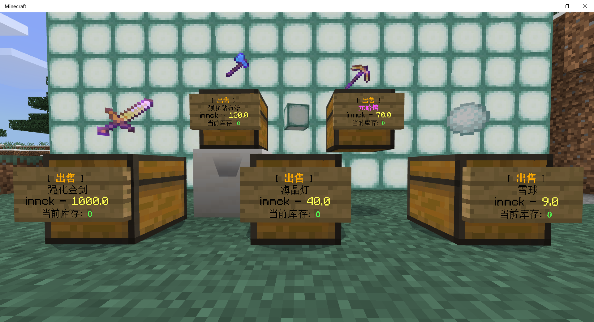
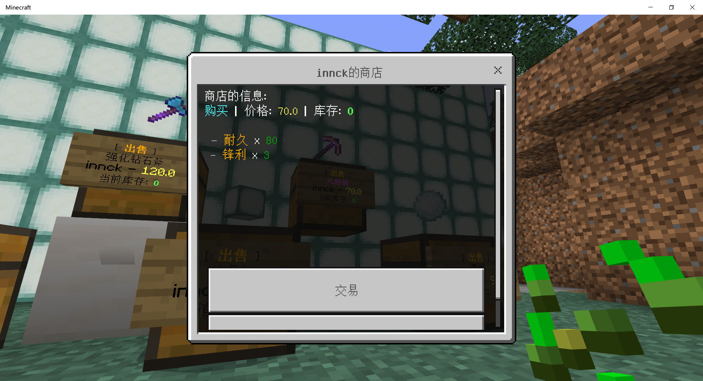
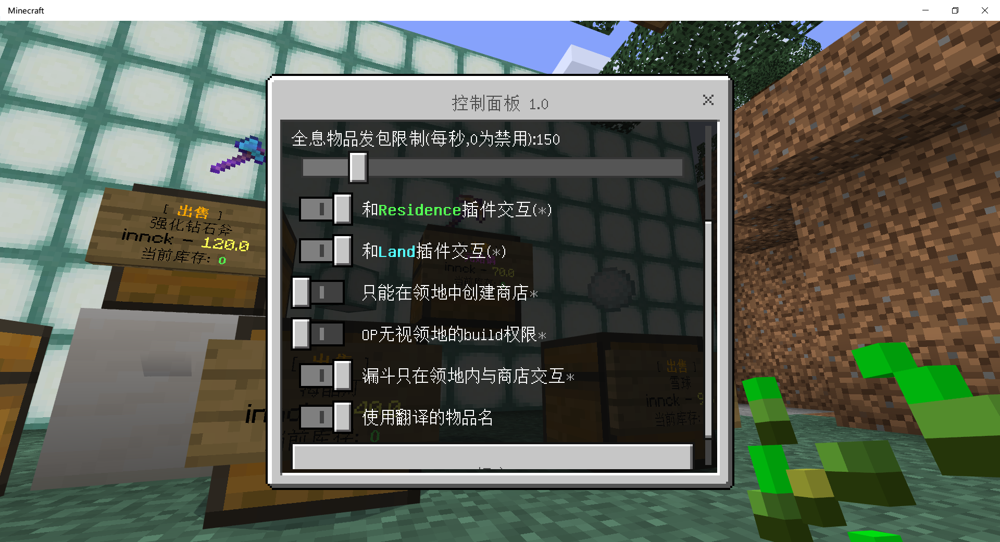
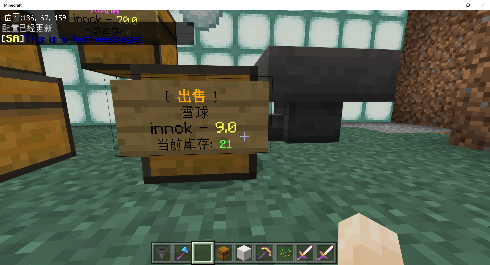
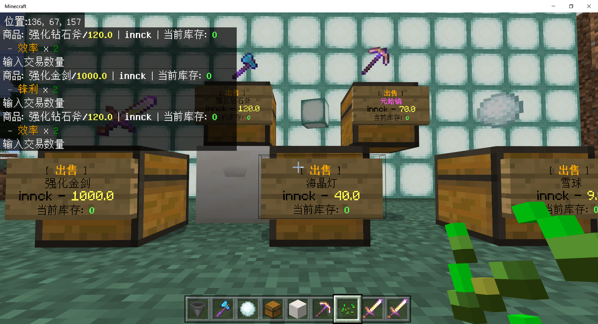
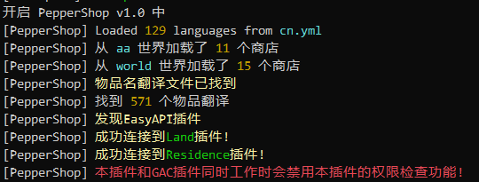

# [PepperShop](https://github.com/innc11/PepperShop)

一个Nukkit插件,基于 [QuickShopX](https://github.com/innc11/QuickShopX) 开发,QuickShopX又是基于是由原作者 [WetABQ](https://github.com/WetABQ) 的QuickShop插件所开发而来

[English Edtion](README_EN.md)

## 图片 Preview













## 配置文件

```yaml
# 语言，支持加载自定义的语言文件，目前自带简体中文和英文（cn/en）
language: cn
# 是否使用新API，1.14以下请设置为false，1.14(包含)以上请设置为true
using-new-api: false

# 强制与GAC插件一起工作，但会关闭本插件的权限检查功能
work-with-gac: false

# 商店的交互方式，可用值：ChatBar、Both、Interface，分别代表仅聊天栏、全部启用、仅UI
# 请参考 食用方法->交易 章节，推荐设置为Both
interaction-way: Both

# 商店的交互时间，如果输入价格时发现被当成普通聊天信息被发出去了，请加大此值
interaction-timeout: 5000

# 全息物品数据包的发送速率(每秒)，建议直接设置为1000，如果出现显示不正确的情况适当调低此值
hologram-item-effect: 1000

# 全息物品数据包队列的大小，如果大服出现人多时全息物品不能正常显示、移除、跨世界时，请调高此值（每次增加1万）
packet-queue-capacity： 10000

# 与Residence插件一起工作（需要先安装Residence）
link-with-residence-plugin: true

# 与Land插件一起工作（需要先安装Land）link-with-land-plugin: true

# 是否只能在领地内创建商店（推荐打开）
# 此选项依赖任意一款领地插件，如果没有安装，则没有实际效果
only-create-shop-in-residence-area: true

# OP是否可以无视领地权限打开、破坏商店# 此选项依赖任意一款领地插件，如果没有安装，则没有实际效果
operator-ignore-build-permission: false

# 漏斗是否只能在领地内才能给商店补货，此选项不会影响非商店箱子的正常传输（仅对商店有效）# 此选项依赖任意一款领地插件，如果没有安装，则没有实际效果
# 建议打开
limit-hopper: true

# 是否使用物品翻译文件（如果你想看到中文，请参考下方的 "关于显示中文物品名"并开启此选项）
use-item-name-translations: false
```


## 更新记录 Change logs

#### 1.0 (from QuickShopX)

1. 命令从/qs 变更成/ps，但保留了别名/qs
1. 配置文件结构被重构
2. 增加对GAC插件的处理
3. 全整合化的语言文件，98%可见文字都可以自定义修改
5. 同时支持Land插件和Residence插件
6. 控制面板会自动隐藏当前不可用的选项(当没有安装任何领地类插件时)
7. 修复部分quickshopx遗留下来的有问题的重载逻辑
19. 去掉了潜行模式下破坏商店的选项
11. 合并全息物品按钮，0为禁用，其它值为弃用，设置完毕即时生效
12. 没有安装任何领地类插件时op默认可以打开所有人箱子
13. custom-item-names.yml 更名为 item-translations.yml
16. 修复命令补全时看起来很奇怪的文本
17. 所有超时消息拦截被禁用，转为作为普通聊天消息处理
18. 修复英文语言文件中的一些单词和语法问题

#### 1.1

1. 修复无法从中文世界名读取配置文件的问题

#### 1.2

1. 增加对Land插件1.3.8版本以上的支持

#### 1.3

1. 修复Land插件无法被识别的问题

#### 1.4

1. 增加PowerNukkit-1.4.0.0-PN-ALPHA.2(1.16)版本的支持
2. 修复商店会被活塞推动的bug
3. 修复某些情况下会出现语言变量显示不正确的问题
4. 修复无法自动创建商店牌子的问题
5. 1.14以下版本再使用前请在配置文件设置using-new-api: false
6. 增加设置发包队列大小packet-queue-capacity： 10000，默认是10k，大服可适当增加此值

## 作者 Authors
- [innc11](https://github.com/innc11)

## 原作者 Original Authors
- [WetABQ](https://github.com/WetABQ) 
