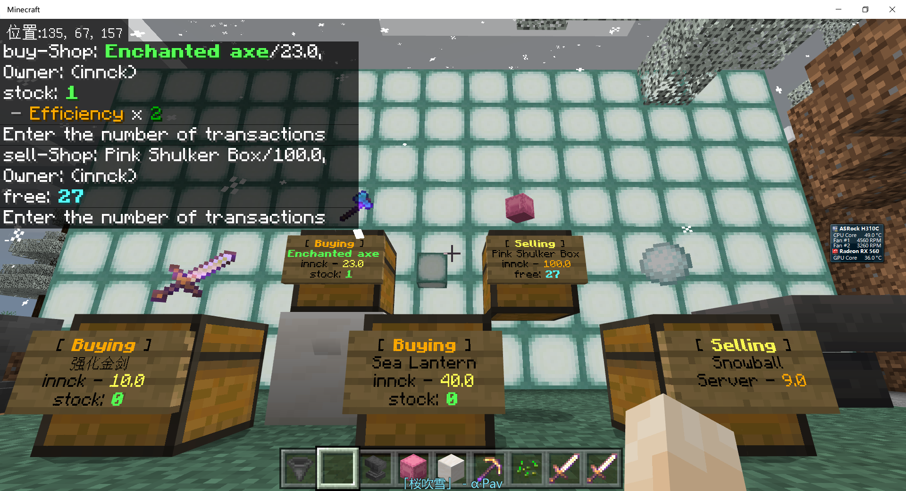
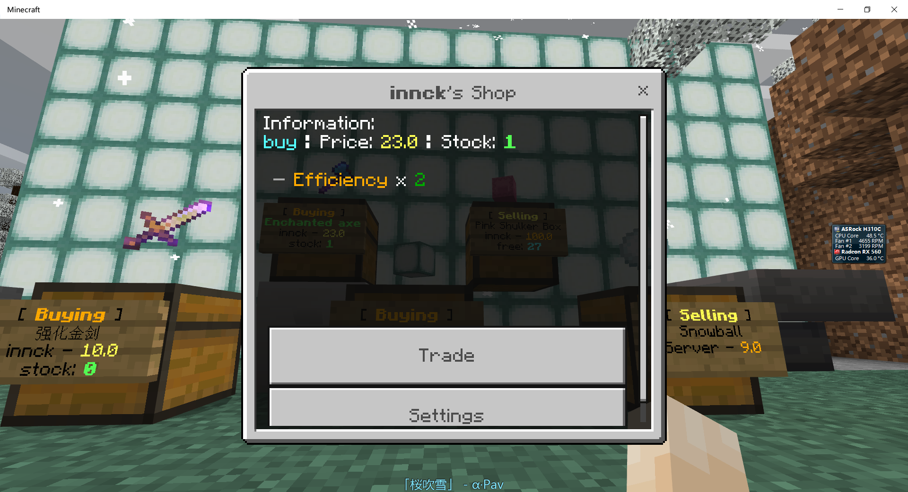
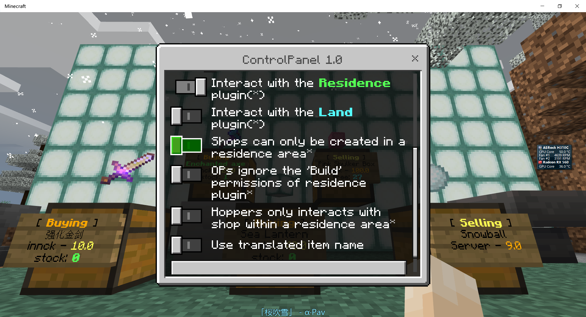
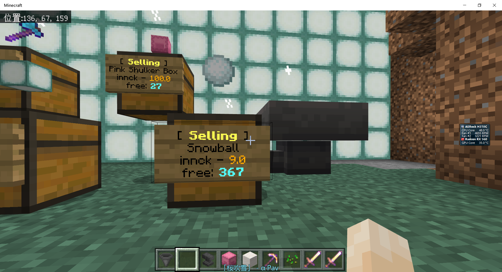
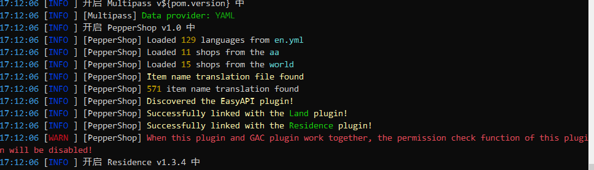

# [PepperShop](https://github.com/innc11/QuickShopX)

A plugin for Nukkit, Based on the QuickShopX(original author [WetABQ](https://github.com/WetABQ)) 

https://www.mcbbs.net/forum.php?mod=viewthread&tid=1057414

## Preview







## Change logs

#### 1.0 (from QuickShopX)
1. Command changed from /qs to /ps, but the alias /qs is retained
1. The configuration file structure was refactored
2. Add the handling of GAC plugins
3. Merge language files, 98% of visible text can be customized
5. Support both Land plugin and Residence plugin
6. The control panel will automatically hide the currently unavailable options
7. Fix some problematic overloading logic left since from quickshopx
19. Removed the option to destroy the shop in snaking mode
11. Incorporate the display switch of the holographic item on the slide bar
12. When no Residence plugin is installed, operators can open everyone's shops by default
13. custom-item-names.yml renamed to item-translations.yml
16. Fix the issue when command completion
17. All timeout message interception is disabled, and it will be processed as a normal chat message
18. Fix some word and grammar problems in English language files

#### 1.1

1. Fix the problem that the configuration file name with Chinese cannot be read

#### 1.2

1. Add the support of Land plugin Version 1.3.9+

#### 1.3

1. Fix the problem that Land plugin cannot be identified

#### PN1.3.2

1. Add support of 1.4.0.0-PN-ALPHA.2(1.16)
2. Fix the problem that chest can be move by piston
3. Fix the problem that sometime the placeholder of language can not be replaced
4. Fix the problem that Sign can not be created automatically
5. Add the options that can be used to set the size of the queue holding the datapacks to be sent to client
6. Rename config field: interactionWay -> interactionMethod

## Authors
- [innc11](https://github.com/innc11)

## Original Authors
- [WetABQ](https://github.com/WetABQ)


### Major changes relative to the QuickshopX：

1. Can now coexist with GAC plugin
2. The scope of the language file covers everywhere, and 99% of the visible text can be customized and modified (except for that message displayed when the language file is loding)
3. Support both Land plugin and Residence plugin
4. Removed the option to destroy the shop in snaking-mode
5. Incorporate the display switch of the holographic item on the slide bar, and the setting will take effect immediately. If set to zero, it will be disabled
6. Fix some word and grammar problems in English language file
7. When neither Land plugin nor Residence plugin are installed, operators can open everyone's chests by default

This version adds the compatibility for GAC. If you must use this plugin with GAC, the permission check function of this plugin will be disabled. When you start the plugin up for the first time, please set it in the configuration file (work-with-gac: true), otherwise this plugin will not start. In addition, please choose one of Residence plugin and Land plugin, and try not to use them at the same time

## How to use

### Creating a shop
Android:   Gently scratch the chest, but don't break the chest, then switch to the item you want for sale on your hand, and finally enter the price directly in the chat bar
Windows10:   Left click on the chest, then switch to the item you want for sale, and finally enter the price directly in the chat bar
In creative mode:   Holding down SHIFT , and then break the chest, follow the above way to create a shop and enter the price directly in the chat bar

### Trading
Char bar:   Click on the sign on the chest and enter the quantity in the chat bar
Interface:   Click on the sign on the chest to open the interface, drag the number of transactions and click Submit
Char bar & Interface:   Double-click the sign on the chest to open the interface way, single-click the sign on the chest to use the chat bar way

### Modifying
Char bar:   Click on the sign and use commands to modify the shop(type '/ps help' for help)
Interface:   Click on the sign to open the interface, and follow the interface prompts to modify
Char bar & Interface:   Choose one of the ways of using the chat bar and the interface

### Destroy shop
Break down the sign on the chest or chest
Special note: People who have the 'build' permissions in the residence area can also open, destroy the chest of a shop

## Configuration file

```yaml
# Configuration file version, do not change
version: 7

# Language, support to load custom language files, currently comes with simplified Chinese and English
language: en

# work with GAC
# If you can accept to disable the permission detection function, you can open
work-with-gac: false

# interaction method, Please refer to the "How to use -> Trading" section，Available values: (ChatBar|Both|Interface)
# Recommended to set to 'Both', you can use the interface and chat bar at the same time
interaction-method: Both

# The waiting time of the message, the default is 5 seconds, after 5 seconds it will become a normal chat message
# If the message is sent as a chat message, please increase this value
interaction-timeout: 5000

# The size of the queue holding the datapacks to be sent to client, double it if hologram-item can not be shown normally (like not be removed when teleport between worlds)
packet-queue-capacity: 10000

# The speed of the holographic item function to send data packets
# It is usually recommended to set to 1000 directly, if there is an item deviation, please adjust it to between 30~100
hologram-item-effect: 1000

# Whether to interact with the Residence plugin (requires the Residence plugin to be installed)
link-with-residence-plugin: true

# Whether to interact with the Land plugin (requires the Land plugin to be installed)
link-with-land-plugin: true

# Whether you can only create a shop in a Residence area
only-create-shop-in-residence-area: true

# The OPs' 'build' permission will not be checked in Residence areas
# This option will help when Ops checking items in a chest. It is recommended to close it at ordinary times, and open it again when troubleshooting.
operator-ignore-build-permission: false

# whether hoppers can only transfer items with a shop's chest in a Residence area
# Normal chest transmission will not be affected. Only shop-chest that are not in a Residence area will be restricted. This item is recommended to be opened
limit-hopper: true

# Whether to use the item name translation, if it is opened, the name of the item display is subject to item-translations.yml, if it is closed, the Nukkit comes with (English)
# This item depends on the item-translations.yml file, please manually download and put it in the plugin folder and then use the reload command to take effect
use-item-name-translations: false
```

## Plugin commands

Use '/ps help' to output all help information. If you are a operator, additional management commands will be displayed. 

## Working with GAC plugin

I have tried several ways to be compatible with GAC, but it doesn't work. If you have installed the GAC, set `work-with-gac: true` in the `config.yml` after the first startup.

## Importing data from QuickShopx

You can import the data-folder of the quickshopx plugin through copying the `shops` folder to inside `PepperShop` folder

## Compat with Land plugin：

The Land plugin does not have `build` permission natively. 

You will have the `build` permission if you have both the `place` and the `break` permission.

In addition, with the mechanism of Land plugin, OPs possess all the permissions of Land plugin by default , which means Ops can open all chests.